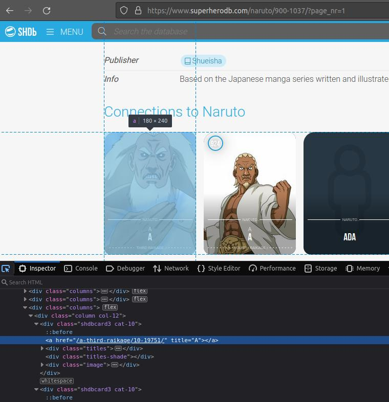
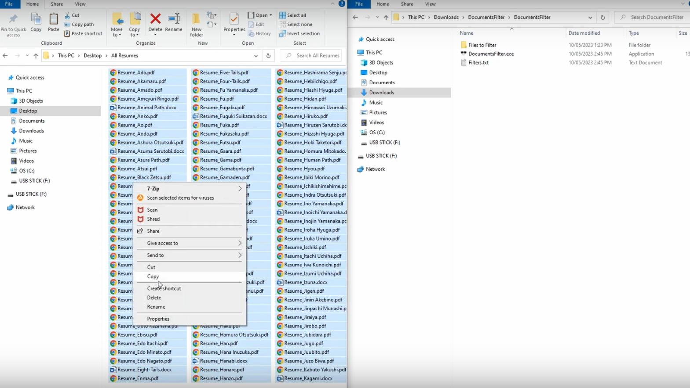

# web-scraper-naruto
While creating the example video for [DocumentsFilter](https://github.com/lmponcio/DocumentsFilter) I realized I needed to show files with names of fictitious job applicants. Then I decided to web scrape the names of characters of a tv series and use those.

## Explained
I used Beautiful Soup. By inspecting the page I realized every character card was contained in a div of class "shdbcard3 cat-10", and the character name was contained in the "title" attribute of an anchor. 



After finding all the divs I extracted the "title" attribute from every anchor using a for loop.

```python

divs=soup.find_all('div',{"class":"shdbcard3 cat-10"})

for div in divs:
    anchor=div.find("a")
    names.append(anchor["title"])
```

## Result
Once I had all the names from the tv series I used them as data for the [YouTube video](https://www.youtube.com/watch?v=h8_KjkikC6U) (screenshot below).



## Last comments
This is not my best web scraper. In [this other project](https://github.com/lmponcio/web-scraper-icecream) I also automated the process of scrapping through the pagination (therefore, I removed the need to hard-code each page), and used openpyxl for an excel spreadsheet to be created with the information organized.
